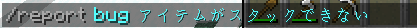

# お問い合わせについて
お問い合わせは、基本Discordサーバーの[**#お問い合わせチャンネル**](https://discord.gg/EFaH45YmD2)からできます。

ですが、Discordアカウントを所持していない方向けに、[form.run](https://form.run/@kinokonetwork)（外部サービス）を使用し、お問い合わせフォームを設置しておりますので、そちらをご利用ください。 しかし、返信にお時間をいただく場合があります。

> 運営メンバーの方々や他鯖主の方々は、お問い合わせとして、 緊急の用事や鯖主直通であれば、メールアドレスやLINEにお願いします。

## Minecraftサーバー内の報告
こちらは規約に違反しているプレイヤーの通報をするためのものです。 
`/report player <mcid> <レポート内容>` 
を打ち込むことによって、運営に報告できます。

こちらはバグが起きた際にバグの内容を報告するものです。 
`/report bug <レポート内容>` 
を打ち込むことによって、運営に報告できます。 

### 以上のコマンドが打てない方向け
`/report`を打つことによって、GUIメニュー上で、報告ができます。 

- プレイヤーの頭をクリック（プレイヤーレポート） 
名札をクリックし、チャットにMCIDを入力することで、その人を報告できます。
 
また、MCIDを入れた後、以下のような表示になるので、該当する行動を、メニュー上のアイテムから選択してください。
 
そのあと、情報が正しければ、緑の羊毛をクリックすることで、報告できます。
 

- オレンジの羊毛をクリック（バグレポート） 

## お問い合わせリンク
尚、確認するまでに時間がかかる場合があり、**返信に最大2週間**かかる可能性があります。

▼お問い合わせリンク（form.run 外部サービスを使用しています。） 
https://form.run/@kinokonetwork

## Discordリンク
**お問い合わせチケットを開くことで、Moderator（運営メンバー）が対応**します。

**サーバー管理者直通で伝えたいことや質問等**は、サーバー管理者である[@kinoko1216](https://discord.com/users/925245386568896564)にフレンドリクエストを送信し、ダイレクトメッセージ上で取り合ってください。

▼Discord招待リンク 
https://discord.gg/Rf5xP5JptK

## お問い合わせ優先度
1. サーバー内チャットでの質問（マイクラにログインしてれば可能）
2. サーバー管理者のDM（許可が必要）
3. お問い合わせチャンネル（全員可能）
4. お問い合わせURL（全員可能）

