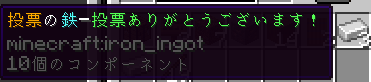

# よくある質問
よくあるよね、っていう質問をまとめますが、ここで回答が分かった際に、お問い合わせしても同じ答えが返ってきます。 
詳しい説明は、付ける場合がありますが、ここのページを見るほうが速いでしょう。
[[toc]]

---

### Q.投票しても何かもらえますか？
#### A. 今はもらえませんが、アイテムを付ける予定です。
投票すると、鉄インゴット1個（名称に着色）が貰えます。（オフライン時だと安定しないので、オンライン時に投票することをお勧めします。）あと、鯖主が喜びます。🎉

### Q. 他コミュニティでの宣伝はOKですか？
#### A. 他コミュニティの方針に従ってください。
ここでのルールではなく、他コミュニティが提示している方針に従って、サーバーの宣伝をするようにしてください。 
また、サーバーを侮辱したり、信用を下げるような行為は、KinokoNetWork利用規約に違反します。

### Q. 荒らしてる人を見かけたから、チャットで指摘してもいい？
#### A. チャットで指摘する暇があるのであれば、運営に報告してください。
荒らしている人や頭がおかしそうな人の報告は、チャットで発言することなく、お問い合わせへお願いします。 
下手に刺激をしても、知能が低いので、おもしろがる猿のように変化するだけなので、運営にすぐ報告をしてください。 
また、示唆する行為や助長する行為は、KinokoNetWork利用規約に違反します。

### Q. サーバー内で、他コミュニティの宣伝は行ってもいいですか？
#### A. ダメです。
他サーバーや他コミュニティの宣伝をするのは、KinokoNetWork利用規約で禁止されています。

### Q. マイクラサーバーに入れなくなりました。
#### A. 運営へ問い合わせしてください。
Discordであれば、#お問い合わせチャンネルから可能です。 
Discordに入れない方は、form.run（外部サービス）から可能です。 
詳しくは、[お問い合わせ](contact.md)をご覧ください。