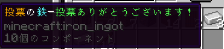

# 投票について
現在、サーバーではプレイヤーへの宣伝として投票機能を設けています。

投票機能とは、外部サービス「[MinePortal](https://mineportal.jp/servers/cm5j7f1hi0000iuiqxfe3t47j)」と「[minecraft.jp](https://minecraft.jp/servers/kinoko.ddns.net)」の「きのこサーバー2」への投票を行うと、スコアが上がり、宣伝につながることです。

投票すると、鉄インゴット1個（名称に着色）が貰えます。（オフライン時だと安定しないので、オンライン時に投票することをお勧めします。）あと、鯖主が喜びます。🎉

投票するには、外部サービスのログインをしないといけません。

Wikiに説明が記載される予定です。お待ちください。

- MinePortalサーバーリスト → https://mineportal.jp/servers/cm5j7f1hi0000iuiqxfe3t47j
- Minecraft.jpサーバーリスト → https://minecraft.jp/servers/kinoko.ddns.net

ログインしている方は、上記のURLから投票が可能です。