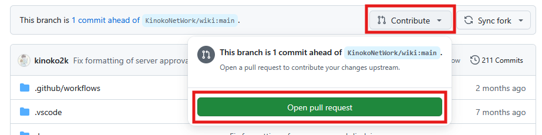

# Wikiの編集について
このWikiは、KinokoServer2の運営によって更新され続けています。 

[[toc]]

## 編集時のルール
1. 公序良俗に反する内容は書かない。
2. 名誉棄損に値する内容は書かない。
3. 曖昧な情報は、書く前にDiscordで相談する。

## 編集の仕方
このWikiは、Markdownというマークアップ言語で書かれています。  
`# タイトル`と打つだけで、主題にできる感じです。

慣れれば簡単です。

## 編集方法について
1. 下記のリンクを開く（GitHubログイン済みの状態）  
https://github.com/KinokoNetWork/wiki

2. Forkボタンを押す。

3. `Create Fork`を押す。

4. `wiki/docs/`の中にある、Wikiファイルを編集する。

5. 右上の`Commit changes`を押す。

6. 左上の`Code`を押して、ホームに戻り、`Contribute`を押して、`Open pull request`を押す。

7. 別ページが開いたら、`Create pull request`を押して、完了  
※Assigneesに`@kinoko2k`を入れてくれるとありがたい。  

::: warning 勝手にMargeしないでください。
絶対に、鯖主が確認するまで、運営はマージしないでください。  

:::