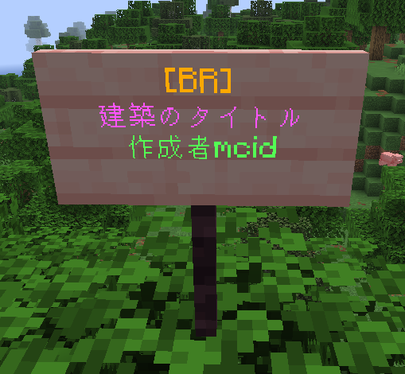

# BuildReviewerについて

建てた建築を評価してもらうために作成された鯖独自のプラグインです。
建築の前に下記の写真のような文字列で看板を設置し右クリックすることで
ID,建築タイトル,作成者,座標を確認できるようになります。 

右クリックされた看板はサバイバルログに記録され、下記のような状態で見ることができます。 

## レビュー

`/br review <建築ID> <評価(3~5まで)> <コメント>`と打つことで建築のレビューを書くことができます。 
また、建築の看板をもう一度クリックすることでレビューの平均や詳細を閲覧することができます。 
### コマンド
| コマンド名 | 説明 | 
|---------|------|------|
|`/br show <建築ID>`|IDに対応した建築の詳細を表示します。|
|`/br showlist`|登録された建築のリストを名前付きで表示します。|