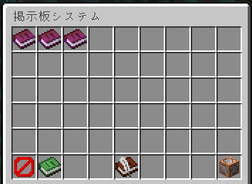
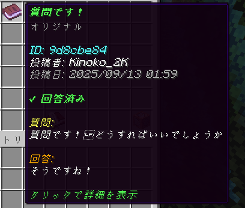
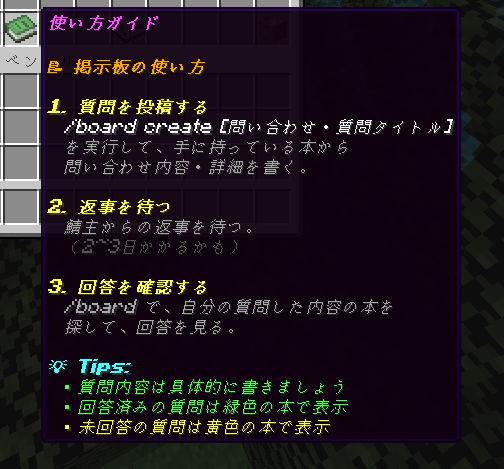

# MsgBoardについて
::: tip
原則、鯖主が回答します。
:::

`/board`で運営とプレイヤーが~~会話できる~~（一方通行）**掲示板を作成**しました。  
`/board create [質問・問い合わせタイトル]`というコマンドを実行すると、本が手に入るので、**質問・問い合わせの内容**を書き、適当なタイトルで保存すると、**掲示板に質問が表示**されます。  
運営ではなく鯖主が回答すると、本の説明欄に回答が載ります。`/board`で随時確認するようにしてください。  
ログイン状態で、鯖主が回答した場合は通知されます。

※全プレイヤーが確認できるので、ルールに沿った内容で作成してください。MCIDを記入してもいいですが、悪口は避けてください。  
※まだデバッグ途中なので、バグが出た場合は、皮肉ですがこの掲示板で報告してください。  

  
  

## コマンドリスト
| コマンド | 概要 |
| ------- | ----- |
| `/board` | 掲示板を表示する |
| `/board create [質問・問い合わせタイトル]` | 投稿を作成する |

