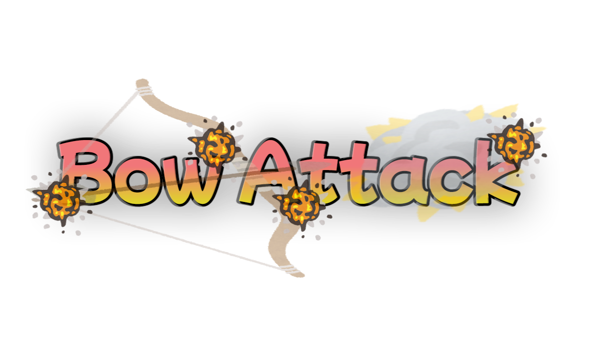

# ミニゲームサーバー（MinigameServer）
::: danger
現在サーバーは、不具合により停止中です。
:::

何もないっす。

開発中のゲームはありますが...

## BowAttack

弓vs弓の簡単なPvP！ 

### やり方
1. `/start <戦うプレイヤーのmcid> <ゲームモード>`でゲームを開始できる。
2. 弓で戦う

### ゲームモード種類
- **normal（ノーマルモード）**
  - 弓1個と矢64個が配られ、相手が死ぬ、または制限時間を過ぎると、ゲームが終了する！
- **1hp（1hpモード）**
  - 射撃ダメージLv255の弓と矢が配られ、一発当たっただけで爆散する！
- **knockback（ノックバックモード）**
  - ノックバックLv5の弓と矢が配られ、相手を場外（マグマダイブ）させることで、ゲームに勝利できる！

### コマンド
- `/start <戦うプレイヤーのmcid> <ゲームモード>`
  - ゲームを開始する。
- `/ranking`
  - ランキングを表示する。（権限必須）

### ゲーム情報
- 制限時間は1分（60秒）
- マップは、1個のみ（なんかあるやつ）
- 制作時間は、5日（Plugin+建築）

## 爆弾鬼ごっこ（開発中）