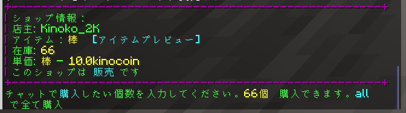

# 買い物について
サバイバルサーバーでは、プレイヤー同士でアイテムを売買できるシステムが導入されています。

## プレイヤーショップの作り方
チェストに向かって、`/qs create 価格`を実行すると、手に持ってるアイテムを売ることができます。  
ショップができた後、看板を右クリックしたら、設定が変更できます。

### アイテムの購入・売却方法
1. ショップの看板を左クリックします。

2. 購入・売却したい数だけ、チャットに打ち込みます。
3. 完了します。

## 大体、運営が決めたアイテムの取引相場価格

