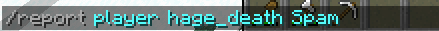
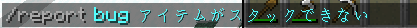

# サバイバルサーバー（SurvivalServer）
普通のバニラ+保護Pluginを導入したサバイバルサーバーです！

普通のサバイバルサーバーを想定したサーバーです。<br>
なので、チェスト保護ぐらいしかありません。（機能は）

::: details サバイバルサーバールール {open}
# きのこサーバー Survivalサーバー ルール
すべて、KinokoNetWork利用規約に準拠し、処罰時は、こちらのルールで処罰されます。

処罰に関して気になることは、[よくある質問](../../info/qa.md)をご確認ください。

## 禁止事項
1. 他プレイヤーの建築の無断破壊、アイテム窃盗する行為
2. サーバーへ意図的に負荷を与える行為
3. 他プレイヤー・運営のなりすまし、詐欺行為
4. 自動ツール、チートクライアント、またはXray等に該当するテクスチャの使用
5. 不具合を意図的に利用、隠蔽、または他プレイヤーに示唆する行為
6. 他プレイヤーに対して、公序良俗に反する発言・誹謗中傷・差別・脅迫・強要をする行為
7. 他サーバー、他サービスへの勧誘行為
8. 他プレイヤーに対して、許可なしPvPやアイテム、ツールを使い、プレイ妨害をする行為
9. 高負荷なトラップタワーの作成、許可なしのトラップタワーの作成は、運営判断で撤去・停止・処罰する場合があります。
10. その他、運営内で不適切と判断した行為

## マナー
1. 挨拶をしよう。
2. 一般常識を持とう。
3. 自分の建築物とわかるようにしよう。
4. TTを作成時には、チャットまたはコマンド(/tt)で、座標と種類を必ず言うようにしよう。
5. みんなが使えるように、使い方と注意を看板で書いて、自由に使えるトラップタワーを作ろう。
6. トラップタワーは、1人5個にし、常時稼働装置（クロック回路など）はあまり作らないようにしよう。
7. 他プレイヤーのTTを占有したり、改造しないようにしよう。
8. 新参者に鉄以上の高価なツールを渡さないようにしよう。
9. ルール違反者がいたら、チャットで言わずに、運営に報告しよう。

2025年1月26日 制定<br>
2025年3月16日 一部改訂<br>
2025年5月30日 マナー改訂<br>
2025年8月18日 一部改訂<br>
2025年9月24日 マナー改訂<br>
2025年10月5日 マナー改訂<br>
2025年11月01日 禁止事項, マナー改訂<br>
:::

## 主な追加機能・要素
- 死ぬと、アイテムが、その場のチェストに保存され、左クリックで回収可能です。
- 投票した際に、オンライン時だと、鉄インゴット1個が配られます。
- エンドで[エリトラが使用不可](https://note.com/kinoko1216/n/nabad73bb6437?sub_rt=share_sb)です。
- [ミッションについて](mission)
- [ランクについて](../../info/prefix)

::: details LWC（チェスト保護） {open}
サバイバルサーバーでは、チェストの中身を取られないようにするように、チェスト保護機能があります。<br>
※チェスト保護をしてないチェストでの窃盗は、処罰対象外になることがあります。

### チェスト保護の仕方
- チェストを置く


### 個人保護から共通保護にする方法
`/cmodify public`を打った後に、対象チェストを左クリックする。

### コマンド一覧
[]は、実行する際に消して大丈夫です。
| コマンド | 概要 |
| --- | --- |
| /cprivate | 個人保護にします。 |
| /cpublic | 共有保護にします。 |
| /cdonation | 寄付保護にします。 |
| /csupply | 提供保護にします。 |
| /cpassword [password] | パスワード保護にします。 |
| /cmodify [private/public/donation/supply..] | 個人保護から別の設定に変更します。 |
| /cunlock [password] | パスワード保護を解除します。 |
| /cinfo | 保護の情報を表示します。 |
| /cremove | 保護を削除します。 |
:::

::: details プレイヤーレポート {open}
```mcfunction
/report player <mcid> <レポート内容>
```
を打ち込むことによって、運営に怪しいプレイヤーを報告できます。<br>


また、Pluginやサーバーの不具合等は、
```mcfunction
/report bug <レポート内容>
```
を打ち込むことによって、運営に不具合が報告できます。

:::

::: details ユーザ設定機能
`/usersettings`を使用すると、ユーザ設定がチャットで開きます。

- Sidebar
  - 右にあるスコアボード表示を削除できます。
- Automsg
  - 定期的に表示されているメッセージを削除できます。
:::

::: details 特定の文字列で絵文字に変換される機能
- `:thinking:` → 🤔
- `:smile:` → 😃
- `:sad:` → 😢
- `:angry:` → 😡
- `:heart:` → ❤️
- `:thumbsup:` → 👍
- `:thumbsdown:` → 👎
:::

::: details [SimpleVoiceChat](https://modrinth.com/plugin/simple-voice-chat/versions)（ボイスチャット機能） {close}
このサーバーは、試験的に[**SimpleVoiceChat**](https://modrinth.com/plugin/simple-voice-chat/versions)**を導入**しております。<br>
この機能は、ModであるSimpleVoiceChatを**導入することで、作動する機能**であり、**サーバー内でボイスチャットができるMod**です。<br>
※YouTubeでよく見る人狼ゲーム等で使用されるModです。<br>

**入れなくても、サーバーに参加できます。** 使用等は、サーバー上での、意思疎通などに使用してください。<br>
SimpleVoiceChatを使用して、**サーバー上で他プレイヤーへの嫌がらせ、荒らし行為は、KinokoNetWork利用規約第三条に違反し、処罰対象**になりますので、見かけたら運営の報告や/reportをお願いします。<br>
※運営メンバーは、すぐに確認できないため、使用には気を付けてお使いください。<br>
